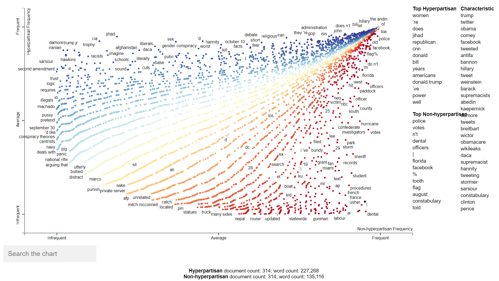
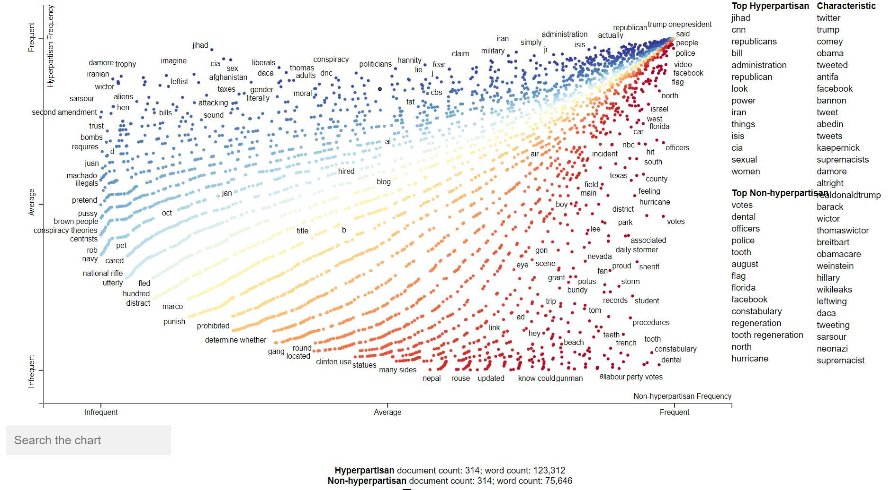

# Hyperpartisan News Analysis With Scattertext

Hyperpartisan news are those that take an extreme left-wing or right-wing standpoint. Detecting hyperpartisan news automatically can be useful to tag them and inform readers. This was the goal of the SemEval 2019 Task 4.

The purpose of this work is to analyze the usage of words in documents which are hyperpartisan and non-hyperpartisan. Hyperpartisan news are those that exhibit blind, prejudiced, or unreasoning allegiance to one party, faction, cause, or person.

Whereas the task on semeval was to design a system to automatically detect hyperpartisan news, in this exercise we are going to exploit both corpora and analyze which terms are the most relevant in each of the sets.

We use two different methods for analysing hyperpartisan and non-hyperpartisan documents. First, we calculate log-odd ratios to extract the most relevant words of each category. Then, we use Scattertext to build an interactive HTML scatter plot. We compare the results of each method and extract some conclusions.

We visualized the differences between hyperpartisan and non-hyperpartisan of the original text and cleaned text (before and after the preprocessing of the text).

## Original Text

Most frequent words in both hyperpartisan articles are stopwords, and we can also see that in both cases some there are some non-words character sequences (= twsrc\%5etfw, type="external">august). We can see all the words and which of them appear most in hyperpartisan and non-hyperpartisan articles in the next figure. Click for an interactive version.

Overall we see that this corpus needs to be cleaned, as there are a lot of stopwords and character sequences that doesn't form words (from URLs, for example).

## Cleaned Text

By cleaning the text, we get better results, as the all the words we get for both top-hyperpartisan and non-hyperpartisan terms exists. We can see all the words and which of them appear most in hyperpartisan and non-hyperpartisan articles in the next figure. Click for an interactive version.

If we compare the results of both figures, we can see that words from the cleaned corpus also appear in the original ones, and for most of them in the same place. And if we look at the more characteristic words of the whole corpus, we see that they are almost the same, and they usually have political connotation (trump, obama, antifa, supremacist, neonazi...).